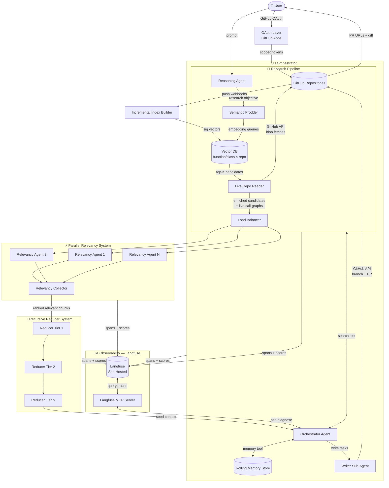
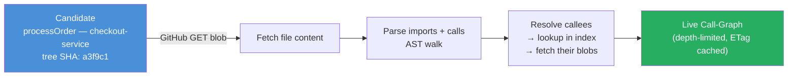
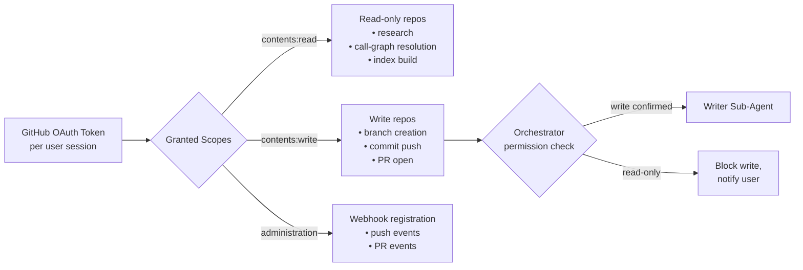
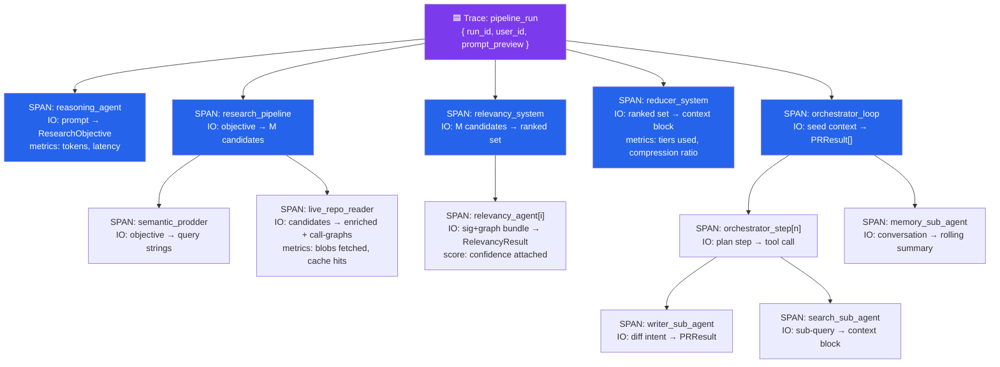
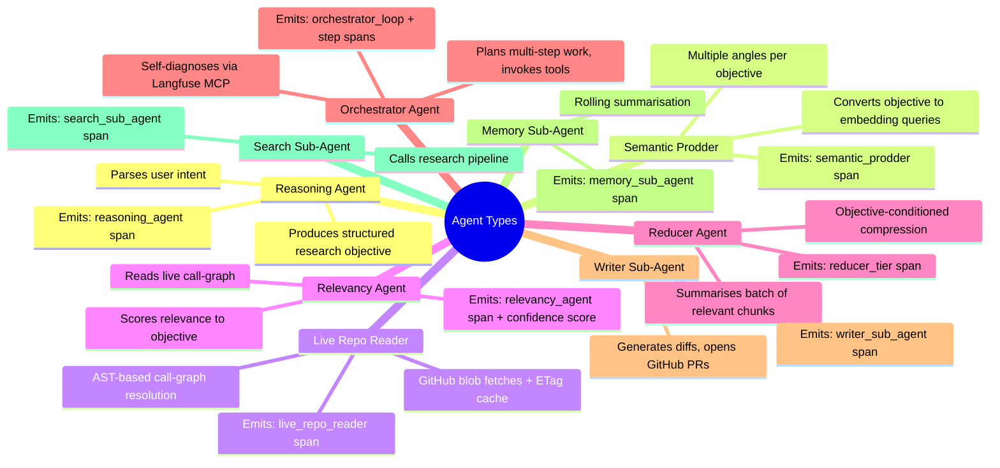
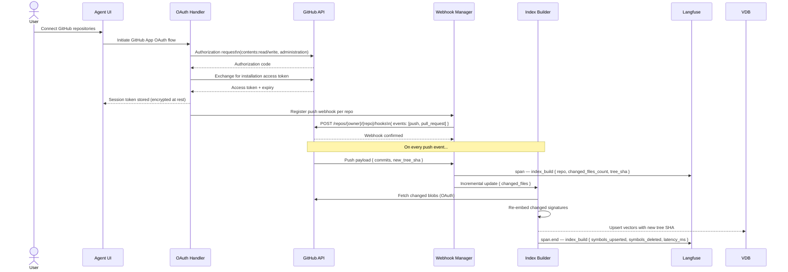
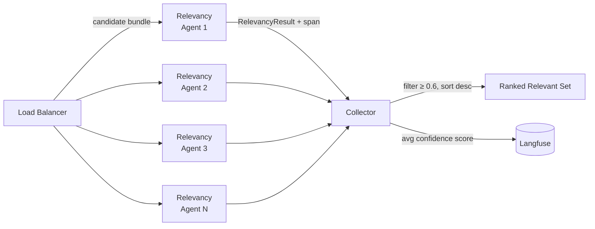
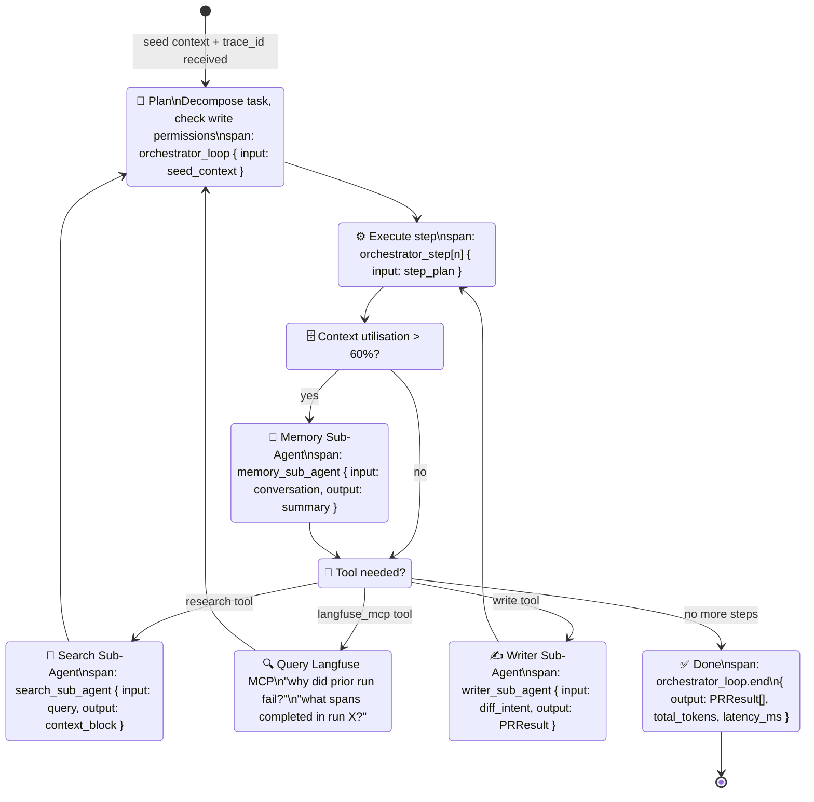

# Multi-Repo Coding Agent — System Design

> A distributed, agentic coding system that orchestrates research and code-writing across multiple GitHub repositories using hybrid RAG, OAuth-gated live repo reads, parallel relevancy filtering, recursive context reduction, a stateful orchestrator with delegated sub-agents, and end-to-end observability via self-hosted Langfuse.

---

## Table of Contents

1. [System Overview](#1-system-overview)
2. [Core Concepts](#2-core-concepts)
3. [Component Deep-Dives](#3-component-deep-dives)
   - [3.1 OAuth & GitHub Access Layer](#31-oauth--github-access-layer)
   - [3.2 Hybrid RAG Index](#32-hybrid-rag-index)
   - [3.3 Research Pipeline](#33-research-pipeline)
   - [3.4 Parallel Relevancy System](#34-parallel-relevancy-system)
   - [3.5 Recursive Reducer System](#35-recursive-reducer-system)
   - [3.6 Orchestrator Agent](#36-orchestrator-agent)
   - [3.7 Sub-Agent Registry](#37-sub-agent-registry)
   - [3.8 Observability Layer — Langfuse](#38-observability-layer--langfuse)
4. [End-to-End Flow](#4-end-to-end-flow)
5. [Context Management Strategy](#5-context-management-strategy)
6. [Data Schemas](#6-data-schemas)
7. [Failure Modes & Resilience](#7-failure-modes--resilience)

---

## 1. System Overview

The system accepts a free-form user prompt and produces coordinated code changes spanning any number of GitHub repositories. OAuth tokens gate all repo access — the index is kept live via webhook-driven incremental updates, call-graphs are resolved against actual file contents at query time, and the Writer Sub-Agent closes the loop by opening PRs directly. Every agentic handoff emits a structured span to a self-hosted Langfuse instance, producing a full trace tree with IO diffs, token counts, latencies, and scored alerts visible in the Langfuse UI and queryable by the orchestrator via the Langfuse MCP server.



---

## 2. Core Concepts

### Hybrid RAG Index

Each function and class across all connected repositories is stored as a **two-part embedding**:

| Dimension | What is embedded | Purpose |
|---|---|---|
| **Signature** | Name, params, return type, docstring | Fast semantic lookup |
| **Repo Slot** | Repository identifier + tree SHA | Namespace isolation + staleness detection |

The vector points to a **lightweight index record** — not the full body. Bodies and call-graphs are always fetched live from GitHub via OAuth at query time. The index is purely a navigation structure.

### Live Call-Graph Resolution

Rather than a pre-baked call-graph store, the system resolves call-graphs on demand:



Blobs are cached by `(repo, path, blob_sha)` — a cache hit costs zero API calls. The tree SHA on each index record lets the reader detect staleness before fetching.

### Access Permission Model



### Langfuse Trace Anatomy

Every pipeline run maps to a **single Langfuse trace** with a strict parent-child span hierarchy. This is the backbone of the observability model — each component section below describes exactly which spans it emits.



### Agent Taxonomy



---

## 3. Component Deep-Dives

### 3.1 OAuth & GitHub Access Layer

The OAuth layer manages GitHub App tokens, translates them into scoped API clients, and registers webhooks for incremental index maintenance.



**GitHub App scopes used**

| Scope | Purpose |
|---|---|
| `contents: read` | Blob fetches, tree traversal, index build |
| `contents: write` | Branch creation, file commits |
| `pull_requests: write` | Open and describe PRs |
| `administration: write` | Webhook registration per repo |
| `metadata: read` | Repo listing, access verification |

**Token lifecycle**

| Event | Action |
|---|---|
| Session start | Installation access token fetched; stored encrypted at rest |
| Token near expiry (< 5 min) | Silently refreshed via GitHub App private key |
| 401 response | Force refresh; re-prompt user if App installation revoked |
| Repo disconnected | Webhook deleted; index entries for that repo purged |

---

### 3.2 Hybrid RAG Index

The index is event-driven — it rebuilds only what changed on each push, keeping embeddings current without full re-indexing.

```
On push webhook received:
  LF.span("index_build", { repo, tree_sha })
  for each changed file:
    blob     = github_fetch(repo, file_path, new_tree_sha)   // ETag cached
    symbols  = ast_parse(blob)
    for each symbol:
      sig_vec = embed(signature + docstring)
      upsert(sig_vec, { repo, path, name, tree_sha, blob_sha, access_level, kind })
  for each deleted file:
    delete_vectors(repo, file_path)
  LF.span.end({ symbols_upserted, symbols_deleted, latency_ms })

Query time:
  query_vecs = semantic_prodder(research_objective)   // multiple query angles
  candidates = vector_db.search(query_vecs, top_k=K)  // merged, deduped
  // bodies fetched live — never from the index
```

**Key design choices**

- **(function, repo) composite key** — prevents cross-repo collisions on identical function names.
- **Signature-only embedding** — bodies excluded from vectors; fetched live via GitHub blob endpoints.
- **tree SHA on every record** — Live Repo Reader detects staleness without an extra round-trip.
- **Multi-query prodding** — objective turned into several query angles to maximise recall.

---

### 3.3 Research Pipeline

```mermaid
sequenceDiagram
    participant RA as Reasoning Agent
    participant SP as Semantic Prodder
    participant VDB as Vector DB
    participant LRR as Live Repo Reader
    participant GH as GitHub API
    participant PAR as Parallel Relevancy
    participant LF as Langfuse

    Note over RA,LF: Parent span: research_pipeline (opened by orchestrator)

    RA->>LF: span.start — reasoning_agent\n{ input: raw_prompt }
    RA->>RA: extract intent, entities, repos in scope
    RA->>LF: span.end — reasoning_agent\n{ output: ResearchObjective,\n  tokens_in, tokens_out, latency_ms }
    RA-->>SP: ResearchObjective

    SP->>LF: span.start — semantic_prodder\n{ input: ResearchObjective }
    SP->>SP: generate N query strings
    loop for each query string
        SP->>VDB: embed + similarity search → top-K
    end
    VDB-->>SP: merged candidate list
    SP->>LF: span.end — semantic_prodder\n{ output: candidate_count,\n  query_count, latency_ms }
    SP-->>LRR: candidate sig_ids

    LRR->>LF: span.start — live_repo_reader\n{ input: candidate_count }
    loop for each candidate (batched)
        LRR->>GH: GET /git/blobs/{sha} — ETag cache check
        GH-->>LRR: file content (or 304 Not Modified)
        LRR->>LRR: AST walk → extract callees
        loop callees depth ≤ 3
            LRR->>GH: GET /git/blobs/{sha} — ETag cached
            GH-->>LRR: callee content
        end
    end
    LRR->>LF: span.end — live_repo_reader\n{ blobs_fetched, cache_hits,\n  cache_hit_rate, latency_ms }
    LRR-->>PAR: M enriched candidates
```

**ResearchObjective schema**

```jsonc
{
  "goal": "Understand how order discount logic flows from API to DB",
  "entities": ["applyDiscount", "processOrder", "cart"],
  "repos_in_scope": [
    { "repo": "checkout-service", "access": "write" },
    { "repo": "pricing-lib",      "access": "read"  }
  ],
  "exclusions": ["test files", "mock adapters"],
  "cg_depth_limit": 3,
  "expected_output": "context block for orchestrator"
}
```

---

### 3.4 Parallel Relevancy System

Each enriched candidate is handed to a Relevancy Agent that reads the live call-graph and scores it against the ResearchObjective. Every agent emits its own child span with the confidence score attached as a Langfuse **score** — this is what powers the confidence-drop alert.



**Span emitted per Relevancy Agent**

```jsonc
// langfuse.span("relevancy_agent", { parent: "relevancy_system" })
{
  "name": "relevancy_agent",
  "input": {
    "sig_id": "checkout-service::processOrder",
    "call_graph_depth": 3,
    "input_tokens": 1840
  },
  "output": {
    "relevant": true,
    "confidence": 0.91,
    "reason": "Directly orchestrates discount application and DB persistence",
    "key_symbols": ["applyDiscount", "db.persist"]
  },
  "scores": [
    { "name": "relevancy_confidence", "value": 0.91 }
  ],
  "usage": { "input": 1840, "output": 112 },
  "latency_ms": 1240
}
```

**Alert rule — confidence drop:** Langfuse alerts when the mean `relevancy_confidence` score across all agents in a run falls below `0.55`. This typically signals the semantic prodder generated poor query angles, and the orchestrator is notified to reformulate before proceeding.

**Collector span**

```jsonc
// langfuse.span("relevancy_system")
{
  "input": { "candidate_count": 42 },
  "output": {
    "accepted": 18,
    "rejected": 24,
    "mean_confidence": 0.78,
    "filtered_below_threshold": 8
  },
  "latency_ms": 3800   // wall clock — agents ran in parallel
}
```

---

### 3.5 Recursive Reducer System

The reducer compresses the ranked relevant set through as many tiers as needed, always conditioned on the ResearchObjective. Each tier emits its own span so the trace shows exactly how many tiers ran and the compression ratio achieved at each step.

```mermaid
flowchart TD
    RS[Ranked Relevant Set\nM chunks × ~2K tokens each] --> T1

    subgraph T1 ["Tier 1 — Reducer Agents (parallel)"]
        R1A[Reducer 1A]
        R1B[Reducer 1B]
        R1C[Reducer 1C]
    end

    T1 --> LF1[📊 span: reducer_tier_1\n{ input_tokens, output_tokens,\ncompression_ratio, latency_ms }]
    LF1 --> CHECK{tokens ≤ target?}
    CHECK -- No --> T2

    subgraph T2 ["Tier 2 — Reducer Agents (parallel)"]
        R2A[Reducer 2A]
        R2B[Reducer 2B]
    end

    T2 --> LF2[📊 span: reducer_tier_2\n{ input_tokens, output_tokens,\ncompression_ratio, latency_ms }]
    LF2 --> CHECK2{tokens ≤ target?}
    CHECK2 -- No --> T3[Tier 3...]
    CHECK2 -- Yes --> OUT[Final Context Block]
    CHECK -- Yes --> OUT
```

**Alert rule — reducer tier overrun:** Langfuse alerts if `tiers_completed > 3` on any run. This signals the relevancy collector is passing too many chunks through, and the confidence threshold or top-K value likely needs tuning.

**Parent span emitted for the full reducer system**

```jsonc
// langfuse.span("reducer_system")
{
  "input": {
    "chunk_count": 18,
    "total_input_tokens": 36000,
    "target_tokens": 6000
  },
  "output": {
    "tiers_completed": 2,
    "final_tokens": 5840,
    "overall_compression_ratio": 0.162
  },
  "latency_ms": 6200
}
```

---

### 3.6 Orchestrator Agent

The orchestrator is the primary reasoning loop. It receives the Final Context Block as seed and iterates until the task is complete. All writes go through the Writer Sub-Agent. Critically, the orchestrator has access to the **Langfuse MCP server** — it can query its own prior spans to self-diagnose failures, understand past decisions, and avoid repeating work across sessions.



**Orchestrator system prompt contract (abbreviated)**

```
You are a multi-repo coding orchestrator with GitHub OAuth access to live repositories.
Every run has a trace_id — include it in all tool calls for span correlation.

Tools available:

  search(query, repos?) → ContextBlock
    Runs the research pipeline against live GitHub repo contents.
    Prefer narrow repo scopes when you know where to look.

  write(repo, branch, path, diff, pr_title, pr_body) → PRResult
    Delegates to Writer Sub-Agent. Creates branch, commits diff, opens PR.
    Only call for repos with access_level: "write".
    Group related changes into a single PR per repo where possible.

  memory_summary() → Summary
    Compress conversation via Memory Sub-Agent.
    Call proactively at 60% context utilisation.

  langfuse_mcp.get_trace(trace_id) → TraceTree
  langfuse_mcp.get_spans(filter) → Span[]
  langfuse_mcp.get_scores(run_id) → Score[]
    Query your own observability data. Use to self-diagnose failures,
    check what prior steps completed, or understand why a run scored poorly.

Plan before acting. Never emit raw code yourself — all writes go through write().
Check access_level before scheduling any write task.
```

---

### 3.7 Sub-Agent Registry

| Sub-Agent | Trigger | Inputs | Output | Langfuse Span |
|---|---|---|---|---|
| **Search Sub-Agent** | Orchestrator calls `search()` | Query, optional repo scope | Ranked context block | `search_sub_agent` |
| **Writer Sub-Agent** | Orchestrator calls `write()` | Repo, branch, diff, PR metadata | `PRResult` | `writer_sub_agent` |
| **Memory Sub-Agent** | Context utilisation > 60% | Full conversation history | Compressed rolling summary | `memory_sub_agent` |
| **Live Repo Reader** | Research pipeline | Candidate sig_ids, OAuth token, depth | Enriched candidates + call-graphs | `live_repo_reader` |
| **Relevancy Agent** | Load balancer | Sig + call-graph bundle, objective | `RelevancyResult` + confidence score | `relevancy_agent[i]` |
| **Reducer Agent** | Per tier | Chunk batch, objective, token budget | Compressed narrative | `reducer_tier_N` |

Each sub-agent carries a specialised system prompt constraining it to a single responsibility. Sub-agents are stateless between invocations — all state lives in the orchestrator's managed context.

---

### 3.8 Observability Layer — Langfuse

Langfuse is deployed as a **self-hosted Docker service** (Langfuse app + Postgres). The system instruments every agentic handoff using the Langfuse SDK; the Langfuse MCP server exposes the resulting trace data back to the orchestrator for self-diagnosis.

#### Deployment

```
services:
  langfuse:
    image: langfuse/langfuse:latest
    environment:
      DATABASE_URL: postgres://...
      NEXTAUTH_SECRET: ...
      LANGFUSE_SECRET_KEY: ...
    ports: ["3000:3000"]

  postgres:
    image: postgres:15
    volumes: ["langfuse_db:/var/lib/postgresql/data"]

  langfuse-mcp:
    image: langfuse/langfuse-mcp:latest
    environment:
      LANGFUSE_HOST: http://langfuse:3000
      LANGFUSE_SECRET_KEY: ...
    ports: ["3001:3001"]
```

#### Instrumentation Pattern

Every component follows the same three-line pattern at each handoff boundary:

```python
# Open span at handoff IN
span = langfuse.span(
    name="component_name",
    parent_id=parent_span_id,
    input={"key": "structured input payload"}
)

# ... component does its work ...

# Close span at handoff OUT
span.end(
    output={"key": "structured output payload"},
    usage={"input": tokens_in, "output": tokens_out},
    metadata={"latency_ms": elapsed, "extra": "fields"}
)

# Attach scores where applicable (relevancy agents, reducer tiers)
langfuse.score(span_id=span.id, name="relevancy_confidence", value=0.91)
```

#### What Each Surface Shows

**Trace Tree** — the Langfuse UI renders the full parent-child span hierarchy as a waterfall. Each pipeline run appears as a single collapsible tree. You can see at a glance which tiers ran, which relevancy agents fired, and where latency was spent.

**IO Diff View** — every span stores its `input` and `output` as structured JSON. The UI renders these side-by-side, so you can see exactly what data crossed each handoff boundary — the ResearchObjective going into the Semantic Prodder, the ranked set coming out of the Relevancy Collector, the diff going into the Writer Sub-Agent, etc.

**Token + Latency Metrics** — all spans carry `usage.input`, `usage.output`, and `latency_ms`. Langfuse aggregates these into per-agent dashboards: mean token consumption per agent type, p95 latency per tier, total cost per pipeline run.

**Alerts** — two alert rules are active by default:

| Alert | Condition | Meaning |
|---|---|---|
| `low_relevancy_confidence` | Mean `relevancy_confidence` score < 0.55 on a run | Semantic prodder generated poor query angles; reformulation needed |
| `reducer_tier_overrun` | `tiers_completed > 3` on any run | Too many chunks passing relevancy filter; threshold or top-K needs tuning |

#### MCP Integration

The Langfuse MCP server exposes three tools the orchestrator uses for self-diagnosis:

```
langfuse_mcp.get_trace(trace_id)
  → Full span tree for a given run. Used to understand what completed
    before a crash or timeout.

langfuse_mcp.get_spans(filter: { name, min_score, repo, time_range })
  → Filtered span list. Used to find all relevancy_agent spans that
    scored below threshold, or all writer_sub_agent spans for a given repo.

langfuse_mcp.get_scores(run_id)
  → All attached scores for a run. Used to assess overall run quality
    and decide whether to retry with adjusted parameters.
```

This gives the orchestrator genuine self-awareness — it can ask "what did my last run do and why did it fail?" without any human in the loop.

---

## 4. End-to-End Flow

The full flow from GitHub OAuth setup to merged PR, with Langfuse span boundaries shown at every handoff.

```mermaid
sequenceDiagram
    actor User
    participant AUTH as GitHub OAuth
    participant OA as Orchestrator Agent
    participant RA as Reasoning Agent
    participant SP as Semantic Prodder
    participant VDB as Vector DB
    participant LRR as Live Repo Reader
    participant GH as GitHub API
    participant PAR as Parallel Relevancy
    participant RED as Recursive Reducers
    participant MEM as Memory Sub-Agent
    participant WA as Writer Sub-Agent
    participant LF as Langfuse

    User->>AUTH: GitHub OAuth App flow
    AUTH->>GH: Register push webhooks
    GH-->>AUTH: Webhooks confirmed

    Note over GH,VDB: Index builds incrementally on each push
    GH->>LF: span — index_build { repo, changed_files }
    GH->>VDB: re-embed changed symbols
    VDB->>LF: span.end — index_build { symbols_upserted }

    User->>OA: prompt + session token
    OA->>LF: trace.start — pipeline_run { run_id, user_id, prompt_preview }

    OA->>RA: parse intent
    RA->>LF: span — reasoning_agent { input: prompt }
    RA-->>OA: ResearchObjective
    RA->>LF: span.end — { output: objective, tokens, latency_ms }

    OA->>SP: objective → prodding queries
    SP->>LF: span — semantic_prodder { input: objective }
    SP->>VDB: multi-vector search
    VDB-->>SP: top-K candidates
    SP->>LF: span.end — { output: candidate_count, query_count }

    SP->>LRR: candidates
    LRR->>LF: span — live_repo_reader { input: candidate_count }
    LRR->>GH: batch GET blobs (ETag cached)
    GH-->>LRR: live file contents
    LRR->>LRR: AST walk → resolve call-graphs
    LRR->>LF: span.end — { blobs_fetched, cache_hits, latency_ms }
    LRR-->>PAR: M enriched candidates

    OA->>LF: span — relevancy_system { input: M }
    par N agents in parallel
        PAR->>LF: span — relevancy_agent[i] { input: sig_id }
        PAR->>PAR: score sig + live call-graph vs objective
        PAR->>LF: span.end + score(relevancy_confidence, 0.91)
    end
    PAR-->>RED: ranked relevant set
    OA->>LF: span.end — relevancy_system { accepted, rejected, mean_confidence }

    OA->>LF: span — reducer_system { input_tokens, target_tokens }
    loop until tokens ≤ target
        RED->>LF: span — reducer_tier_N { input_tokens, output_tokens }
        RED->>RED: reduce batch
        RED->>LF: span.end — { compression_ratio, latency_ms }
    end
    RED-->>OA: Final Context Block
    OA->>LF: span.end — reducer_system { tiers_completed, final_tokens }

    OA->>OA: plan steps (check access_level)
    OA->>LF: span — orchestrator_loop { input: seed_context }

    loop for each planned step
        OA->>LF: span — orchestrator_step[n] { input: step_plan }

        alt needs more research
            OA->>LF: span — search_sub_agent { input: sub_query }
            OA->>LRR: search(sub-query)
            LRR->>GH: GET blobs (ETag)
            LRR-->>OA: additional context
            OA->>LF: span.end — search_sub_agent { output: context_block, tokens }
        end

        alt self-diagnosis needed
            OA->>LF: langfuse_mcp.get_trace(prior_run_id)
            LF-->>OA: prior span tree
        end

        OA->>LF: span — writer_sub_agent { input: diff_intent, repo, path }
        OA->>WA: write(repo, branch, path, diff, pr_title)
        WA->>GH: POST create branch
        WA->>GH: PUT commit file
        WA->>GH: POST create PR
        GH-->>WA: PR URL + head SHA
        WA-->>OA: PRResult
        OA->>LF: span.end — writer_sub_agent { output: pr_url, branch, sha }

        alt context approaching limit
            OA->>LF: span — memory_sub_agent { input: turn_count }
            OA->>MEM: memory_summary()
            MEM-->>OA: compressed rolling summary
            OA->>LF: span.end — memory_sub_agent { output: summary_tokens }
        end

        OA->>LF: span.end — orchestrator_step[n] { output: step_result }
    end

    OA->>LF: trace.end — pipeline_run\n{ pr_urls, total_tokens, total_latency_ms, steps_completed }
    OA-->>User: PRs opened + summary
```

---

## 5. Context Management Strategy

Avoiding **context rot** — stale, contradictory, or redundant content accumulating in the window — is critical for long multi-step tasks.

```mermaid
flowchart TD
    A[Orchestrator receives new info] --> B{Context utilisation?}
    B -- "< 40%" --> C[Append to working context]
    B -- "40–60%" --> D[Flag for next summarisation]
    B -- "> 60%" --> E[Trigger Memory Sub-Agent]

    E --> F[Memory Sub-Agent receives\nfull conversation]
    F --> G["Produce rolling summary:\n• decisions made\n• symbols confirmed relevant\n• PRs already opened\n• open questions\n• access levels per repo"]
    G --> H[Replace conversation history\nwith summary + last 2 turns]
    G --> LF[📊 span: memory_sub_agent\n{ turns_compressed, output_tokens }]
    H --> C
    C --> I[Orchestrator continues]
```

**Rolling Summary Schema**

```jsonc
{
  "task_goal": "Make discount logic async in checkout-service and pricing-lib",
  "decisions": [
    "Use asyncio.gather for parallel DB calls in processOrder",
    "pricing-lib::applyDiscount will become a coroutine"
  ],
  "symbols_confirmed": [
    { "id": "checkout-service::processOrder", "access": "write" },
    { "id": "pricing-lib::applyDiscount",     "access": "read"  },
    { "id": "checkout-service::validateCart", "access": "write" }
  ],
  "prs_opened": [
    {
      "repo": "checkout-service",
      "pr": 142,
      "url": "https://github.com/org/checkout-service/pull/142",
      "branch": "agent/async-discount"
    }
  ],
  "open_questions": [
    "Does the retry decorator in checkout-service support async?",
    "pricing-lib is read-only — confirm manual PR needed from user"
  ],
  "turn_count": 14
}
```

The Memory Sub-Agent is instructed to **never discard symbol names, repo access levels, PR URLs, or open questions** — only prose rationale may be compressed.

---

## 6. Data Schemas

### Index Record (Vector DB)

```jsonc
{
  "id": "checkout-service::processOrder",
  "vector": [/* 1536-dim embedding of signature + docstring */],
  "metadata": {
    "repo": "checkout-service",
    "owner": "org",
    "path": "src/orders.py",
    "kind": "function",                // "function" | "class" | "method"
    "name": "processOrder",
    "signature": "def processOrder(order_id: str) -> OrderResult",
    "docstring": "Validates and persists an incoming order...",
    "tree_sha": "a3f9c1d8...",         // staleness detection
    "blob_sha": "e7b2a4f1...",         // ETag cache key
    "access_level": "write"            // from GitHub App scope at index time
  }
}
```

### Live Call-Graph Node (in-memory, not persisted)

```jsonc
{
  "sig_id": "checkout-service::processOrder",
  "body": "def processOrder(order_id):\n    user = fetchUser(order_id)\n    ...",
  "blob_sha": "e7b2a4f1...",
  "callees": [
    {
      "sig_id": "checkout-service::fetchUser",
      "body": "...",
      "blob_sha": "c1d3e9a2...",
      "callees": [ /* depth-2 */ ]
    },
    {
      "sig_id": "pricing-lib::applyDiscount",
      "body": "...",
      "blob_sha": "f4b8c2e7...",
      "repo": "pricing-lib",
      "callees": [ /* depth-2 */ ]
    }
  ],
  "callers": ["checkout-service::handleOrderRequest"],
  "cross_repo_refs": ["pricing-lib::applyDiscount"],
  "resolved_at": "2024-11-14T10:22:31Z",
  "estimated_tokens": 420
}
```

### Writer Sub-Agent Input

```jsonc
{
  "repo": "checkout-service",
  "owner": "org",
  "branch": "agent/async-discount-refactor",
  "base_branch": "main",
  "path": "src/orders.py",
  "intent": "Make processOrder async; await applyDiscount and fetchUser in parallel via asyncio.gather",
  "diff": "--- a/src/orders.py\n+++ b/src/orders.py\n@@ -12,7 +12,7 @@\n-def processOrder\n+async def processOrder...",
  "pr_title": "refactor: make processOrder async",
  "pr_body": "## Summary\nConverts `processOrder` to an async function...\n\n## Changes\n- `fetchUser` and `applyDiscount` now awaited in parallel via `asyncio.gather`",
  "constraints": ["preserve existing error handling", "do not change public signature"],
  "trace_id": "tr_abc123"             // for Langfuse span correlation
}
```

### PRResult

```jsonc
{
  "repo": "checkout-service",
  "pr_number": 142,
  "pr_url": "https://github.com/org/checkout-service/pull/142",
  "branch": "agent/async-discount-refactor",
  "head_sha": "7d3f1a9c...",
  "status": "open"
}
```

### Langfuse Span (generic shape)

```jsonc
{
  "trace_id": "tr_abc123",
  "span_id": "sp_def456",
  "parent_span_id": "sp_parent",
  "name": "component_name",
  "start_time": "2024-11-14T10:22:31.000Z",
  "end_time": "2024-11-14T10:22:32.240Z",
  "input": { /* structured handoff input */ },
  "output": { /* structured handoff output */ },
  "usage": { "input": 1840, "output": 112 },
  "metadata": { "latency_ms": 1240, "repo": "checkout-service" },
  "scores": [
    { "name": "relevancy_confidence", "value": 0.91 }
  ]
}
```

---

## 7. Failure Modes & Resilience

| Failure | Detection | Mitigation | Langfuse Signal |
|---|---|---|---|
| GitHub token expired mid-task | 401 from GitHub API | Silent refresh via App private key; re-prompt if App revoked | `span.metadata.error: "401_token_expired"` |
| GitHub API rate limit | 429 response | Exponential backoff + jitter; ETag caching reduces volume | `span.metadata.rate_limited: true, retry_count` |
| Webhook missed / stale index | tree SHA mismatch in Live Repo Reader | Reader fetches fresh blob, upserts index, continues | `live_repo_reader.metadata.stale_records` |
| Low relevancy confidence | Mean confidence < 0.55 | Langfuse alert fires; orchestrator reformulates queries | Alert: `low_relevancy_confidence` |
| Relevancy agent timeout | Per-agent timeout (10s) | Candidate dropped with warning; noted in collector span | `relevancy_agent.metadata.timed_out: true` |
| Reducer tier overrun | `tiers_completed > 3` | Langfuse alert fires; suggests threshold/top-K tuning | Alert: `reducer_tier_overrun` |
| Orchestrator context limit | Hard token guard | Force Memory Sub-Agent; discard oldest non-critical turns | `memory_sub_agent` span appears unexpectedly early |
| Writer Sub-Agent invalid diff | GitHub API rejects patch | Retry with failure reason + fresh blob content | `writer_sub_agent.metadata.retry: true` |
| Write on read-only repo | `access_level: "read"` in context | Orchestrator blocks write; flags to user | `orchestrator_step.metadata.blocked_write: true` |
| Cross-repo callee missing | Blob 404 from GitHub | Gap noted in relevancy agent span; orchestrator may search | `live_repo_reader.metadata.missing_callees` |
| Circular call-graph | Cycle in AST walk | DFS with visited set; truncated at depth limit | `live_repo_reader.metadata.cycles_detected` |
| Branch name collision | 422 from branch create | Writer appends timestamp suffix and retries once | `writer_sub_agent.metadata.branch_renamed: true` |
| PR already exists for branch | 422 "already has open PR" | Writer returns existing PR URL; treated as success | `writer_sub_agent.metadata.pr_already_exists: true` |
| Self-diagnosis MCP query fails | Langfuse MCP 5xx | Orchestrator logs warning, continues without prior context | `orchestrator_step.metadata.mcp_unavailable: true` |

---

*This document describes the intended architecture. Vector DB, embedding model, and AST parser are intentionally left implementation-agnostic. GitHub is the sole supported VCS provider.*