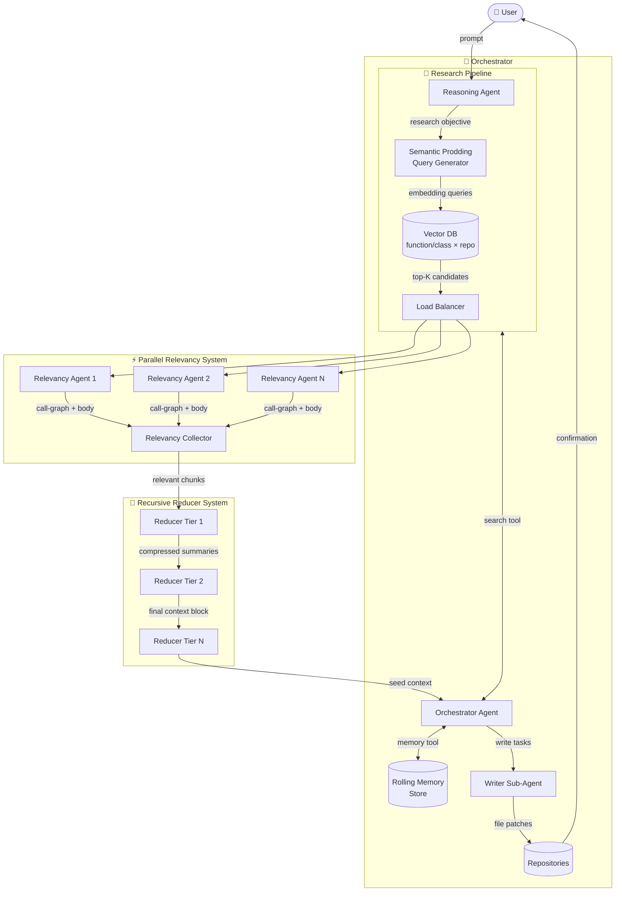
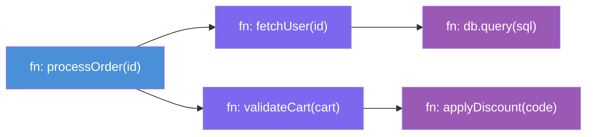
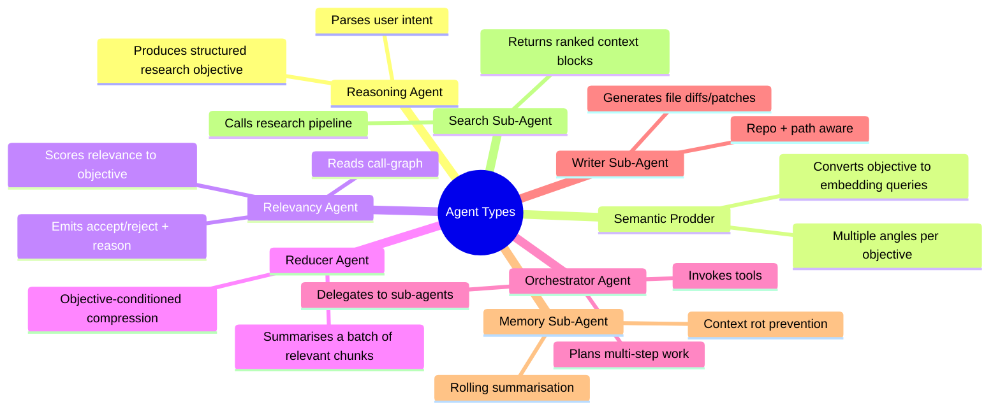
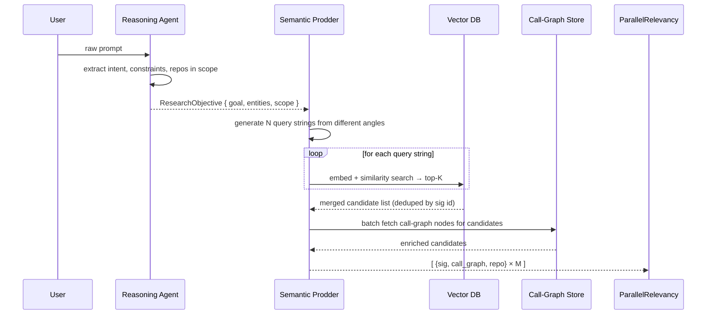
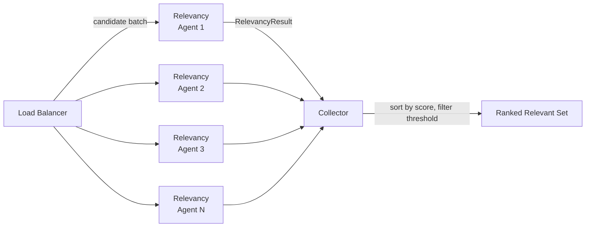
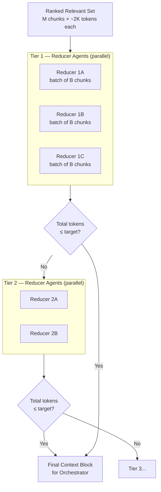
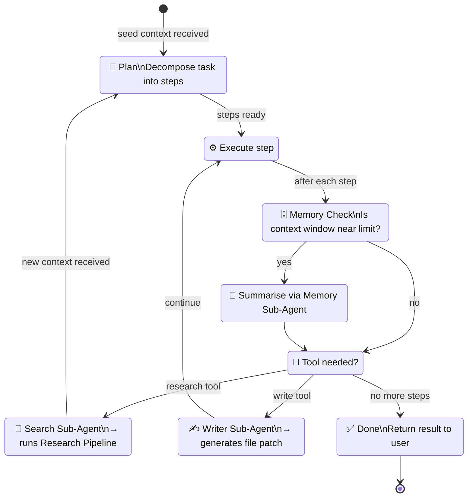
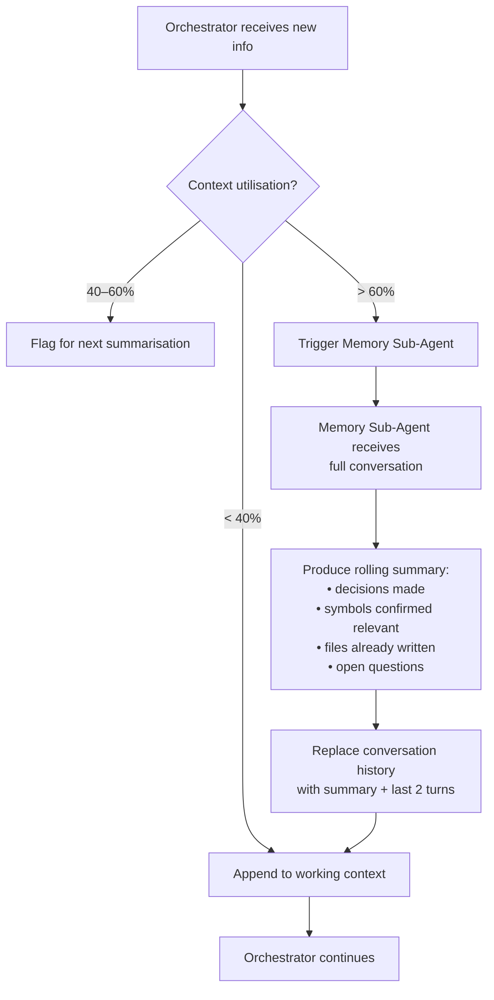

# Multi-Repo Coding Agent — System Design

> A distributed, agentic coding system that orchestrates research and code-writing across multiple repositories using hybrid RAG, parallel relevancy filtering, recursive context reduction, and a stateful orchestrator with delegated sub-agents.

---

## Table of Contents

1. [System Overview](#1-system-overview)
2. [Core Concepts](#2-core-concepts)
3. [Component Deep-Dives](#3-component-deep-dives)
   - [3.1 Hybrid RAG Index](#31-hybrid-rag-index)
   - [3.2 Research Pipeline](#32-research-pipeline)
   - [3.3 Parallel Relevancy System](#33-parallel-relevancy-system)
   - [3.4 Recursive Reducer System](#34-recursive-reducer-system)
   - [3.5 Orchestrator Agent](#35-orchestrator-agent)
   - [3.6 Sub-Agent Registry](#36-sub-agent-registry)
4. [End-to-End Flow](#4-end-to-end-flow)
5. [Context Management Strategy](#5-context-management-strategy)
6. [Data Schemas](#6-data-schemas)
7. [Failure Modes & Resilience](#7-failure-modes--resilience)

---

## 1. System Overview

The system accepts a free-form user prompt and produces coordinated code changes or research reports spanning any number of repositories. It is built around five major stages that progressively compress and enrich context before handing off to an orchestrator capable of iterative, tool-augmented reasoning.



---

## 2. Core Concepts

### Hybrid RAG Index

Each function and class across all repositories is stored as a **two-part embedding**:

| Dimension | What is embedded | Purpose |
|---|---|---|
| **Signature** | Name, params, return type, docstring | Fast semantic lookup |
| **Repo Slot** | Repository identifier | Filter / namespace isolation |

The embedding points into a mapping table that links each signature to its full **call-graph node** — a structured record containing the function body, all callees (recursively resolved), all callers, and cross-repo references.

### Call Graph Representation



Each relevancy agent receives a candidate node **plus its full subgraph** — not just the function in isolation.

### Agent Taxonomy



---

## 3. Component Deep-Dives

### 3.1 Hybrid RAG Index

The index is built offline (or incrementally on push) and queried online.

```
Build time:
  for each repo:
    for each function/class:
      sig_vec  = embed(signature + docstring)
      store(sig_vec, {repo, path, name, call_graph_id})

Query time:
  query_vecs = semantic_prodder(research_objective)   // multiple angles
  candidates = vector_db.search(query_vecs, top_k=K)  // merged, deduped
```

**Key design choices**

- **(function, repo) composite key** — prevents cross-repo false matches where the same function name appears in multiple codebases.
- **Signature-only embedding** — the body is intentionally excluded from the vector. Bodies are fetched lazily via the call-graph mapping, keeping the index lean and the semantic signal clean.
- **Multi-query prodding** — the research objective is turned into several complementary search strings (e.g., by entity, by action, by domain), boosting recall without sacrificing precision.

---

### 3.2 Research Pipeline



**ResearchObjective schema (simplified)**

```jsonc
{
  "goal": "Understand how order discount logic flows from API to DB",
  "entities": ["applyDiscount", "processOrder", "cart"],
  "repos_in_scope": ["checkout-service", "pricing-lib"],
  "exclusions": ["test files", "mock adapters"],
  "expected_output": "context block for orchestrator"
}
```

---

### 3.3 Parallel Relevancy System

Each candidate from the vector search is handed to a **Relevancy Agent** that reads the full call-graph subgraph and makes a binary judgement with a confidence score and rationale.



**Relevancy Agent prompt contract**

Each agent receives:
- The **ResearchObjective**
- A single **(signature + call-graph subgraph)** bundle
- Instructions to return a `RelevancyResult`

```jsonc
// RelevancyResult
{
  "sig_id": "checkout-service::processOrder",
  "relevant": true,
  "confidence": 0.91,
  "reason": "Directly orchestrates discount application and DB persistence",
  "key_symbols": ["applyDiscount", "db.persist"],
  "estimated_tokens": 1840
}
```

Agents run fully in parallel. The **load balancer** distributes candidates round-robin with backpressure if agent capacity is saturated. The **collector** filters by a minimum confidence threshold (default `0.6`) and sorts descending before handing to the reducer tier.

---

### 3.4 Recursive Reducer System

The ranked relevant set may still be too large for the orchestrator's context window. The reducer system compresses it through as many tiers as needed.



**Reducer Agent behaviour**

Each reducer receives:
- The **ResearchObjective** (constant across all tiers — this is the compression north star)
- A **batch of chunks** (function body + call-graph summaries + relevancy rationales)
- Target output budget in tokens

It produces a **compressed narrative** that preserves:
1. Symbol names and their repos (never discarded — needed for tool calls)
2. Key behavioural insight relevant to the objective
3. Cross-chunk dependencies (calls between symbols in the batch)

Tier size `B` and the number of tiers are computed dynamically:

```
tier_1_reducers  = ceil(M / B)
output_per_tier  = reduction_ratio × input_tokens   # e.g. 0.25
tiers_needed     = ceil(log(total_tokens / target) / log(1/reduction_ratio))
```

---

### 3.5 Orchestrator Agent

The orchestrator is the primary reasoning loop. It receives the **Final Context Block** as its seed and iterates until the task is complete or requires user input.



**Orchestrator system prompt contract (abbreviated)**

```
You are a multi-repo coding orchestrator. You have access to three tools:

  search(query: string) → ContextBlock
    Runs the research pipeline. Use when you need to understand
    code you haven't seen yet.

  write(repo: string, path: string, diff: string) → Confirmation
    Delegates a file write to the Writer Sub-Agent.
    Always describe the intent before calling.

  memory_summary() → Summary
    Asks the Memory Sub-Agent to compress your conversation so far.
    Call proactively when approaching 60% of context capacity.

Plan before acting. Prefer targeted searches over broad ones.
Delegate all file writes to Writer Sub-Agent — never emit raw code yourself.
```

---

### 3.6 Sub-Agent Registry

| Sub-Agent | Trigger | Inputs | Output |
|---|---|---|---|
| **Search Sub-Agent** | Orchestrator calls `search()` | Query string, optional repo scope | Ranked context block |
| **Writer Sub-Agent** | Orchestrator calls `write()` | Repo, file path, intent, context | Unified diff / patch |
| **Memory Sub-Agent** | Context utilisation > 60% | Full conversation history | Compressed rolling summary |
| **Relevancy Agent** | Spawned by load balancer | Sig + call-graph bundle, objective | RelevancyResult |
| **Reducer Agent** | Spawned per tier | Chunk batch, objective, token budget | Compressed narrative |

Each sub-agent carries a **specialised system prompt** that constrains it to its single responsibility. Sub-agents are stateless between invocations — all state lives in the orchestrator's managed context.

---

## 4. End-to-End Flow

The full flow from user prompt to committed change, showing interactions between every layer.

```mermaid
sequenceDiagram
    actor User
    participant OA as Orchestrator Agent
    participant RA as Reasoning Agent
    participant SP as Semantic Prodder
    participant VDB as Vector DB
    participant CG as Call-Graph Store
    participant PAR as Parallel Relevancy\n(N agents)
    participant RED as Recursive Reducers
    participant MEM as Memory Sub-Agent
    participant WA as Writer Sub-Agent
    participant REPO as Repository

    User->>OA: "Refactor discount logic to be async across checkout-service and pricing-lib"

    OA->>RA: parse intent
    RA-->>OA: ResearchObjective

    OA->>SP: prodding queries from objective
    SP->>VDB: multi-vector similarity search
    VDB-->>SP: top-K candidates
    SP->>CG: fetch call-graph nodes
    CG-->>SP: enriched candidates
    SP-->>PAR: M candidates

    par N relevancy agents in parallel
        PAR->>PAR: score each (sig + subgraph) vs objective
    end
    PAR-->>RED: ranked relevant set

    loop until tokens ≤ target
        RED->>RED: reduce batch, compress narrative
    end
    RED-->>OA: Final Context Block

    OA->>OA: plan steps

    loop for each step
        alt needs more research
            OA->>SP: search(sub-query)
            SP-->>OA: additional context block
        end

        OA->>WA: write(repo, path, intent, context)
        WA-->>REPO: apply patch
        REPO-->>OA: confirmation

        alt context approaching limit
            OA->>MEM: memory_summary()
            MEM-->>OA: compressed rolling summary
        end
    end

    OA-->>User: changes applied, summary of what changed and why
```

---

## 5. Context Management Strategy

Avoiding **context rot** (stale, contradictory, or redundant content accumulating in the window) is critical for long multi-step tasks.



**Rolling Summary Schema**

```jsonc
{
  "task_goal": "Make discount logic async in checkout-service and pricing-lib",
  "decisions": [
    "Use asyncio.gather for parallel DB calls in processOrder",
    "pricing-lib::applyDiscount will become a coroutine"
  ],
  "symbols_confirmed": [
    "checkout-service::processOrder",
    "pricing-lib::applyDiscount",
    "checkout-service::validateCart"
  ],
  "files_written": [
    "checkout-service/src/orders.py",
    "pricing-lib/src/discount.py"
  ],
  "open_questions": [
    "Does the retry decorator in checkout-service support async?"
  ],
  "turn_count": 14
}
```

The Memory Sub-Agent is instructed to **never discard symbol names, file paths, or open questions** — only prose rationale can be compressed.

---

## 6. Data Schemas

### Index Record (Vector DB)

```jsonc
{
  "id": "checkout-service::processOrder",
  "vector": [/* 1536-dim embedding */],
  "metadata": {
    "repo": "checkout-service",
    "path": "src/orders.py",
    "kind": "function",           // "function" | "class" | "method"
    "name": "processOrder",
    "signature": "def processOrder(order_id: str) -> OrderResult",
    "docstring": "Validates and persists an incoming order...",
    "call_graph_id": "cg:checkout-service:orders:processOrder"
  }
}
```

### Call-Graph Node

```jsonc
{
  "id": "cg:checkout-service:orders:processOrder",
  "body": "def processOrder(order_id):\n    user = fetchUser(order_id)\n    ...",
  "callees": [
    { "sig_id": "checkout-service::fetchUser", "call_graph_id": "cg:..." },
    { "sig_id": "checkout-service::validateCart", "call_graph_id": "cg:..." },
    { "sig_id": "pricing-lib::applyDiscount", "call_graph_id": "cg:..." }
  ],
  "callers": [
    { "sig_id": "checkout-service::handleOrderRequest", "call_graph_id": "cg:..." }
  ],
  "cross_repo_refs": ["pricing-lib::applyDiscount"],
  "estimated_tokens": 420
}
```

### Writer Sub-Agent Input

```jsonc
{
  "repo": "checkout-service",
  "path": "src/orders.py",
  "intent": "Make processOrder async; await applyDiscount and fetchUser in parallel",
  "context": "/* compressed relevant context block */",
  "constraints": ["preserve existing error handling", "do not change public signature"]
}
```

---

## 7. Failure Modes & Resilience

| Failure | Detection | Mitigation |
|---|---|---|
| Vector DB returns irrelevant candidates | Relevancy agents all score < threshold | Orchestrator re-prompts Semantic Prodder with reformulated queries |
| Relevancy agent times out | Timeout per agent (e.g. 10s) | Load balancer marks as failed; candidate dropped with warning |
| Reducer produces output > budget | Token count check post-reduction | Additional reducer tier spawned automatically |
| Orchestrator hits context limit before Memory Sub-Agent | Hard token limit guard | Force immediate summarisation, discard oldest non-critical turns |
| Writer Sub-Agent produces invalid diff | Patch apply fails on repo | Writer retried with failure message + original file content appended |
| Cross-repo call-graph edge missing | CG lookup returns null callee | Relevancy agent notes gap; orchestrator may issue targeted search |
| Circular call-graph | Cycle detected during CG fetch | DFS with visited set; cycles logged and truncated at depth limit |

---

*This document describes the intended architecture. Individual components (Vector DB provider, embedding model, agent runtime, repo interface) are intentionally left implementation-agnostic.*
